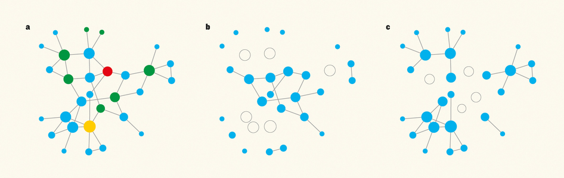
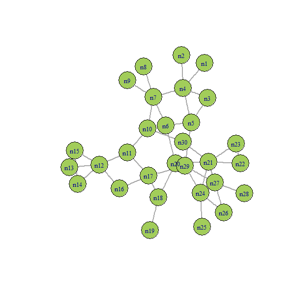

# Collective Influence

Implementation of the collective influence algorithm as presented by [*Morone and Makse* (2015)](http://www.ncbi.nlm.nih.gov/pubmed/26131931). The collective influence computation step has been parallelized for use with large networks.

Depends on [*igraph*](http://igraph.org/).

Example from [*Kovacs and Barabasi* News & Views article (2015)](http://www.ncbi.nlm.nih.gov/pubmed/26245576):
(A) the initial network with highest collective influence node in red, highest degree node in yellow. (B) resultant network, with giant component intact, after removal of the 6 nodes with the highest degree. (C) resultant network after removal of top 4 influencers.

The CI algorithm at work:

